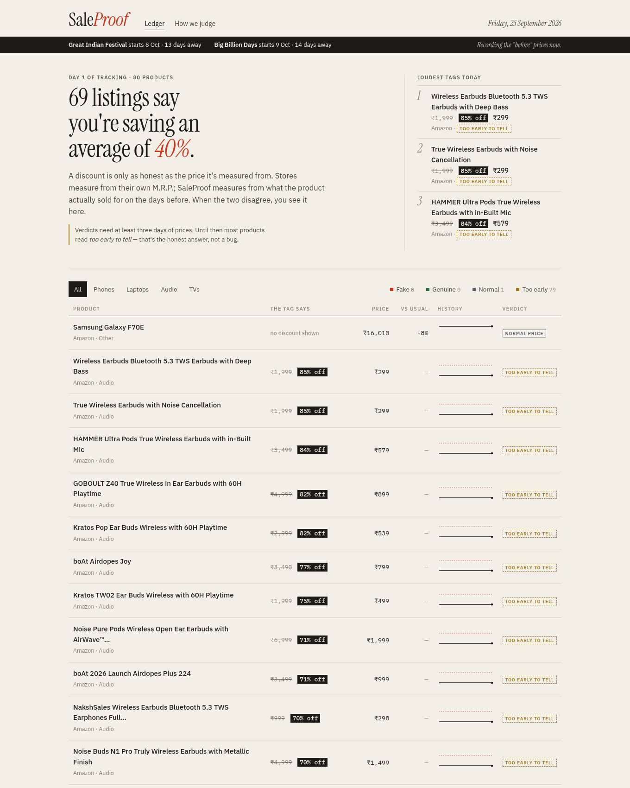
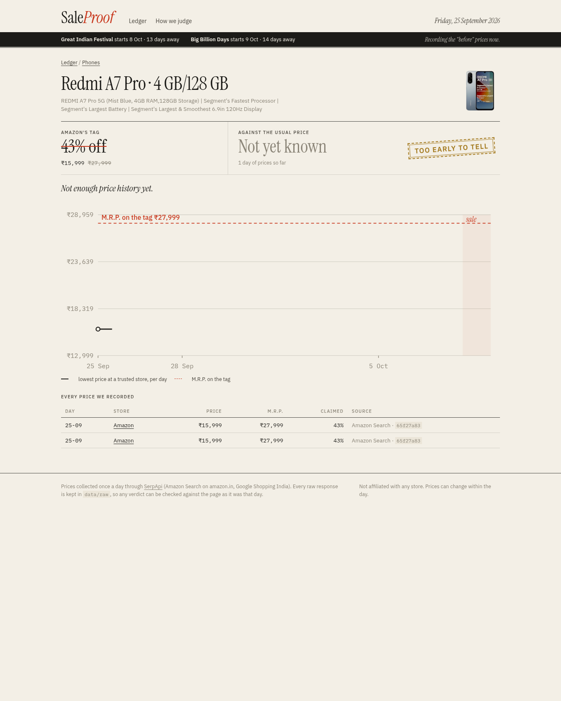

# SaleProof

**Is that "70% off" real?** Indian stores quote discounts against their own M.R.P., and the
seller sets the M.R.P. SaleProof records what products actually cost, every day, so when the
festive sale starts you can see whether a discount is a deal or a relabelled price.

Built for the SerpApi India Hackathon 2026, Commerce & Market Intelligence track.



## Why

Every festive season the same complaint comes back: the "sale price" is what the product cost
last month, and the huge percentage comes from an M.R.P. nobody ever paid. Amazon's Great Indian
Festival starts **8 Oct 2026** and Flipkart's Big Billion Days **9 Oct 2026**. SaleProof started
recording on **25 Sep 2026**, so the "before" prices are real, not reconstructed.

## What it does

- **Daily snapshots** of Amazon.in listings (phones, laptops, earbuds, TVs) and Google Shopping
  India results for hero products, through SerpApi. Runs as a GitHub Actions cron; every raw
  response is committed to [`data/raw`](data/raw), so the price history is publicly timestamped.
- **Matches the same product** across colour variants and stores (`saleproof/normalize.py`):
  "REDMI A7 Pro 5G (Mist Blue, 4GB RAM, 128GB)" and "(Black, 4GB RAM, 128GB)" share one history;
  the 64 GB model does not. Spare parts, cases, refurbished and grey-market import listings are
  kept out of prices.
- **Judges each offer** (`saleproof/verdict.py`) by comparing the discount on the tag with the
  discount against the product's usual price (median of daily lows before today):
  - *Fake discount*: claims 15%+ off but is under 5% below the usual price, or the price was
    raised just before the offer.
  - *Genuine deal*: 10%+ below the usual price.
  - *Normal price* / *Too early to tell* (fewer than 3 days and no other store to compare).
- **Flags the tricks**: M.R.P. far above anything a trusted store charged, different M.R.P. at
  different stores, a pre-sale price hike, cheaper at another store today.
- **Dashboard** with the ledger of verdicts, a per-product price history chart and every price
  recorded with its SerpApi search id.



## SerpApi APIs used, and why

| API | Used for | Why it matters |
| --- | --- | --- |
| [Amazon Search API](https://serpapi.com/amazon-search-api) (`engine=amazon`, `amazon_domain=amazon.in`) | Daily price **and** M.R.P. for ~20 listings per call, four categories | The M.R.P. vs price pair is the discount claim we test. One call covers a whole category, so the free plan can sustain a daily history. |
| [Google Shopping API](https://serpapi.com/google-shopping-api) (`gl=in`) | Prices for hero products at other Indian stores (Flipkart, Reliance Digital, Croma...) | Cross-store prices give a reference price from day one and catch "cheaper elsewhere" and M.R.P. mismatches. |
| [Google Immersive Product API](https://serpapi.com/google-immersive-product-api) | Parser ready for per-product store lists with original prices | Adds store-level "was" prices for heroes when credits allow. |

SerpApi is the whole data layer: without it there is no price history and nothing to judge.

### Credit budget

The free plan has 250 searches a month. The daily job makes **6 calls** (4 Amazon category
searches + 2 Google Shopping heroes), about 180 a month. `SALEPROOF_DAILY_BUDGET` hard-caps paid
calls per day, and re-running on the same day replays the archive for free.

## Run it

```bash
git clone https://github.com/akashrajeev/SaleProof && cd SaleProof
python -m venv .venv && . .venv/bin/activate
pip install -e ".[dev]"
python -m saleproof rebuild      # build data/saleproof.db from the committed archive (no API key needed)
python -m saleproof serve        # http://127.0.0.1:8000
```

To collect your own snapshots, copy `.env.example` to `.env`, add your
[SerpApi key](https://serpapi.com/manage-api-key) and run `python -m saleproof snapshot`.

Other commands: `python -m saleproof report` (verdicts in the terminal),
`python -m saleproof budget` (credit plan and searches left). JSON: `/api/products`, `/api/p/<key>`.

## Tests

```bash
python -m pytest -q
```

## Layout

```
saleproof/
  serp.py        SerpApi client, gzip archive, daily credit cap
  normalize.py   title -> product key (brand, model, RAM, storage; colour ignored)
  stores.py      which sellers count as a fair reference
  ingest.py      SerpApi responses -> offer rows (SQLite)
  verdict.py     the judgement: real vs claimed discount, flags
  analysis.py    per-product histories from the database
  charts.py      hand-built SVG charts
  web/           FastAPI + Jinja dashboard
data/raw/        every SerpApi response, one folder per day
```

## Limits

Bank-card offers, exchange bonuses and checkout coupons are not in listing prices. Prices are
sampled once a day. Different sellers on one marketplace can price the same product differently.

## Sources for sale dates

- Flipkart Big Billion Days 2026 from 9 Oct: [India Today](https://www.indiatoday.in/technology/news/story/flipkart-big-billion-days-sale-2026-dates-announced-discounts-on-iphones-and-samsung-galaxy-expected-2995757-2026-09-16)
- Amazon Great Indian Festival 2026 from 8 Oct: [Times of India](https://timesofindia.indiatimes.com/technology/tech-news/amazon-announces-its-biggest-festive-sale-of-the-year-great-indian-festival-2026-date-bank-offers-discounts-and-more/articleshow/134365784.cms)

## AI tools

Built with help from an AI coding agent (Instinct) for code, tests and docs. Design, product
decisions and review by Akash Rajeev.
